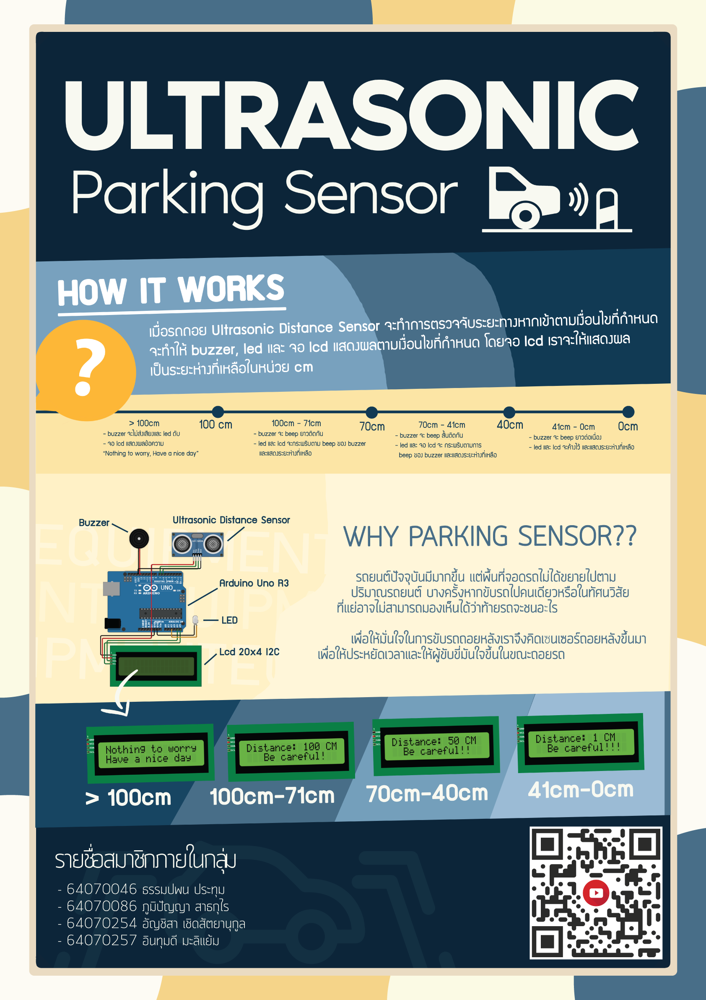

# Ultrasonic Parking Sensor
> Project Computer Programming IT KMITL 2/2021
# Source
 >รถยนต์ปัจจุบันมีมากขึ้น เเต่พื้นที่จอดรถไม่ได้ขยายไปตามปริมาณรถยนต์ บางครั้งหากขับรถไปคนเดียวหรือในทัศนวิสัยทัศน์ที่เเย่อาจไม่สามารถมองเห็นได้ว่าท้ายรถจะชนอะไร เพื่อให้มั่นใจในการขับรถถอยหลังเราจึงคิดเซนเซอร์ถอยหลังขึ้นมา เพื่อให้ประหยัดเวลาเเละให้ผู้ขับขี่มันใจขึ้นในขณะถอยรถ
# Objective
  >เพื่อนำ Microcontroller ที่ได้ศึกษามาประยุกต์ใช้
# Equipment
  > * Arduino Uno R3
  > * Ultrasonic Distance Sensor
  > * Lcd 20x4 I2C
  > * Led
  > * Buzzer
# บทคัดย่อ
  >https://docs.google.com/document/d/1936tBZLajZ-pPZXYmw7gEOF4LAqfCF6-tYZ3FtyNBQU/edit?usp=sharing
# Our Project by WOKWI
  >https://wokwi.com/projects/330750364307423827
# Youtube
  >https://youtu.be/_vu-2YZZsYE
# Poster

### สมาชิก
---

| รหัสนักศึกษา | ชื่อ - นามสกุล |
| :-------- | :-------- |
|   64070046   |   ธรรมปพน ประทุม   |
|   64070086   |   ภูมิปัญญา สาธกุไร   |
|   64070254   |   อัญชิสา เชิดสัตยานุกูล   |
|   64070257  |   อินทุมดี มะลิเเย้ม   |
